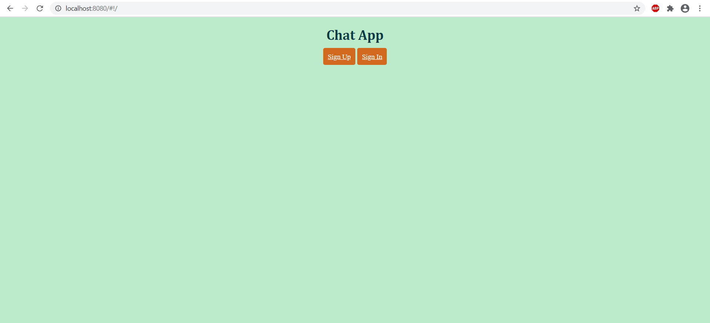
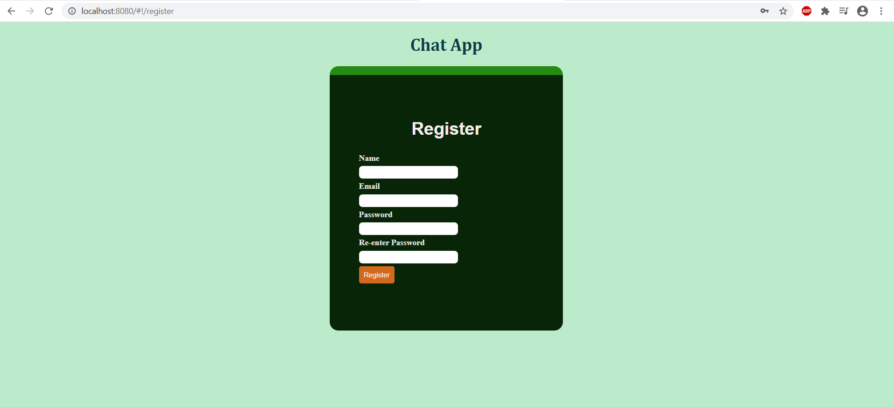
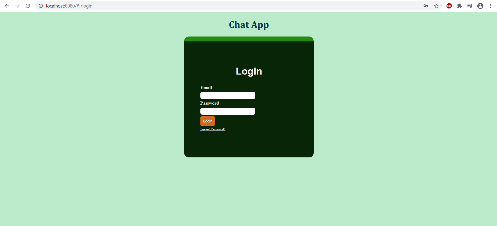
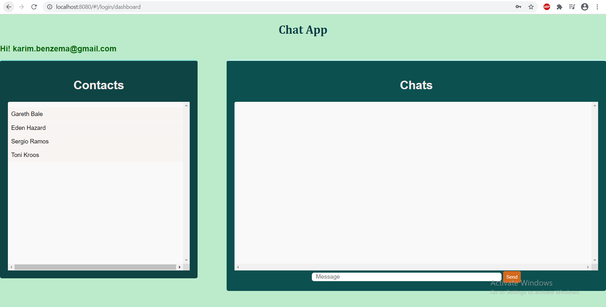

# ChatApp
This App provides Chat Service to the registered users. A registered user can choose the person with whom he/she wants to have a conversation with. An user also has the ability to reset or change password.
## Tech Stack
1. Express.js as the web framework
2. MongoDB as the database
3. AngularJS for frontend development
4. Node.js to handle the server side
5. Socket.IO to enable realtime bi-directional communication.
## Mockups
1. Homepage

2. Registration Page

3. Log In Page

4. Dashboard

Contacts are users who have already registered. For example, in the attached screenshot Karim Benzema(i.e. logged in user) can choose any individual from the contact list to have a conversation with.

5. Chat Illustration
